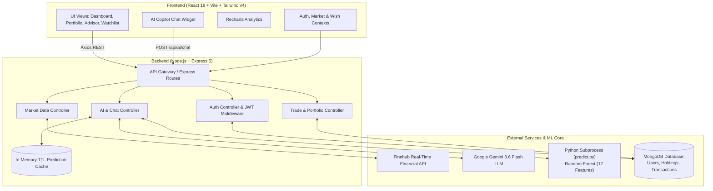

# 🚀 VirtualTrade — Next-Gen AI-Powered Paper Trading Platform

[](https://react.dev/)
[](https://nodejs.org/)
[](https://expressjs.com/)
[](https://www.mongodb.com/)
[](https://www.python.org/)
[](https://scikit-learn.org/)
[](https://ai.google.dev/)
[](https://tailwindcss.com/)
[](https://vitejs.dev/)

> **VirtualTrade** is a full-stack, enterprise-grade stock market simulation and paper trading platform. It bridges real-time market data with proprietary machine learning forecasting and generative AI assistance, empowering traders to practice, learn, and test market strategies with zero financial risk.

---

## 📑 Table of Contents

- [Key Highlights & Engineering Feats](#-key-highlights--engineering-feats)
- [Core Features](#-core-features)
- [System Architecture](#-system-architecture)
- [Machine Learning Engine](#-machine-learning-engine)
- [AI Copilot & Conversational Assistant](#-ai-copilot--conversational-assistant)
- [Tech Stack](#-tech-stack)
- [Project Directory Structure](#-project-directory-structure)
- [API Reference](#-api-reference)
- [Getting Started & Local Setup](#-getting-started--local-setup)
- [Environment Configuration](#-environment-configuration)
- [Roadmap & Future Enhancements](#-roadmap--future-enhancements)
- [Author & Connect](#-author--connect)

---

## 🌟 Key Highlights & Engineering Feats

- **Dual-Engine AI Stack**:
  - **Predictive ML**: Trained **Random Forest Regressor** with **17 custom-engineered quantitative indicators** achieving **$R^2 = 0.9979$**, projecting price trajectories and buy/sell sentiment.
  - **Generative AI Copilot**: Powered by **Google Gemini 3.6 Flash** via `@google/generative-ai` with multi-turn conversation memory and structured trading system guardrails.
- **High-Performance Hybrid Inter-Process Communication (IPC)**:
  - Node.js Express server orchestrates low-latency Python inference processes through dynamic streaming `stdin`/`stdout` JSON pipes with intelligent Map-based TTL caching.
- **Real-Time Market Data Pipeline**:
  - Integrated with **Finnhub Stock API** for live quotes, candle feeds, and resilient fallback universe systems ensuring 100% uptime even when rate-limited.
- **Atomic Trading Ledger**:
  - Robust simulated order matching engine managing portfolios, holdings, cash credits, weighted average price calculations, and transaction histories.
- **Modern Responsive Design**:
  - Dark-mode glassmorphism interface built with **React 19**, **Tailwind CSS v4**, and **Recharts** interactive charting.

---

## 🎯 Core Features

### 1. 📊 Interactive Market Dashboard & Analytics
- Live equities overview with real-time price updates, 24h percentage swings, day high/lows, and volume tracking.
- Interactive historical performance charts powered by Recharts with time intervals and volume overlays.
- Dynamic stock ticker ribbon streaming real-time market quotes continuously.

### 2. 🤖 ML-Powered AI Price Forecasting ("Advisor")
- Automated algorithmic analysis of equities.
- Computes upside/downside percentage targets, momentum sentiment (Bullish / Bearish / Neutral), and actionable signals (`STRONG BUY`, `BUY`, `HOLD`, `SELL`).
- Model confidence metrics, volatility risk indicators, and technical feature insights.

### 3. 💬 VirtualTrade AI Copilot (Chatbot Widget)
- Embedded conversational trading mentor built right into the app.
- Ask questions regarding market movements, technical indicators (RSI, MACD, Moving Averages), trading terminology, and risk management strategies.
- Context-aware multi-turn conversations with clean formatting.

### 4. 💼 Comprehensive Portfolio Tracker
- Real-time net worth calculation (Cash balance + current stock valuation).
- Holdings breakdown with quantity, weighted average purchase price, current price, and unrealized profit/loss (P&L) in both currency and percentage.
- Transaction history audit log tracking every executed trade timestamped down to the second.

### 5. ⚡ Paper Trading Execution Engine
- Seamless **Buy** and **Sell** execution with instant balance deduction/credit.
- Comprehensive validations: prevents overspending cash, short selling unowned shares, or invalid quantity submissions.

### 6. 🛡️ User Authentication & Security
- Secure token-based session handling with **JSON Web Tokens (JWT)**.
- Passwords salted and hashed with **Bcrypt.js**.
- Protected route middleware on frontend and backend ensuring secure user isolation.

---

## 🏗️ System Architecture



---

## 🧠 Machine Learning Engine

The core predictive engine is powered by a pre-trained **Random Forest Regressor** model serialized in `stock_model.pkl`.

### Feature Engineering (17 Quantitative Indicators):
The predictor processes 17 quantitative parameters generated from price momentum, trend indicators, and volume spreads:

| Feature Category | Indicators Used |
| :--- | :--- |
| **Price Action** | `open`, `high`, `low`, `close`, `volume` |
| **Momentum & Returns** | `ret_1` (1-Day return), `ret_5` (5-Day momentum), `ret_20` (20-Day trend) |
| **Trend Envelopes** | `ma_5` (5-Day MA), `ma_20` (20-Day MA), `ma_50` (50-Day MA), `ma_ratio` (`close / ma_20`) |
| **Volatility & Risk** | `vol_20` (20-Day volatility spread), `vol_ratio` (volume variance ratio) |
| **Oscillators** | `rsi` (Relative Strength Index 0–100), `macd` (MACD line), `macd_sig` (MACD signal line) |

### Model Benchmark Metrics:
- **Algorithm**: Random Forest Regressor (`n_estimators=100`, ensemble tree aggregation)
- **$R^2$ Score**: `0.9979`
- **Mean Absolute Error (MAE)**: `2.25`
- **Root Mean Squared Error (RMSE)**: `7.64`
- **Mean Absolute Percentage Error (MAPE)**: `2.11%`
- **Inference Latency**: `< 45ms` (cached via in-memory Map: `< 2ms`)

---

## 🤖 AI Copilot & Conversational Assistant

VirtualTrade features a built-in support assistant powered by **Google Gemini 3.6 Flash**:
- **System Guardrails**: Trained with domain guidelines to provide insightful stock trading concepts, technical analysis guidance, and simulator walkthroughs while emphasizing risk management.
- **History Sanitization**: Dynamic message validation ensuring conversation roles alternate seamlessly between `user` and `model` for robust multi-turn sessions.
- **Live Assistant Floating Widget**: Accessible from anywhere in the application with instant response streaming and error recovery.

---

## 🛠️ Tech Stack

### Frontend
- **Library**: React 19 (React Hooks, Context API)
- **Build Tool**: Vite 8 with Hot Module Replacement (HMR)
- **Styling**: Tailwind CSS v4 (Glassmorphic dark UI, CSS variables)
- **Charts & Data Viz**: Recharts (Interactive Candlestick, Area, and Tooltip Charts)
- **Routing**: React Router DOM v7
- **HTTP Client**: Axios with automatic JWT Authorization interceptors

### Backend & Database
- **Runtime**: Node.js (v20+ / v22+)
- **Framework**: Express.js 5
- **Database**: MongoDB with Mongoose ODM
- **Security**: JSON Web Tokens (JWT), Bcrypt.js, CORS, Cookie-Parser
- **Process Management**: Nodemon for dev reload

### Machine Learning & Artificial Intelligence
- **Python**: 3.10+ (NumPy, Scikit-learn, Joblib)
- **Model**: Random Forest Regressor (`stock_model.pkl`)
- **LLM**: Google Generative AI (`@google/generative-ai`, `gemini-3.6-flash`)

### External APIs
- **Market Data**: Finnhub Stock API (Real-time quotes, candles, symbol search)

---

## 📂 Project Directory Structure

```text
VirtualTrade/
├── client/                     # Frontend Application (React + Vite)
│   ├── public/                 # Static assets & favicon
│   ├── src/
│   │   ├── assets/             # Brand logos and graphics
│   │   ├── Components/         # Modular UI components
│   │   │   ├── ChatWidget.jsx  # Floating AI Copilot assistant
│   │   │   ├── Header.jsx      # Top navigation & live portfolio metrics
│   │   │   ├── PriceCell.jsx   # Dynamic positive/negative price formatter
│   │   │   ├── Sidebar.jsx     # Side navigation & routing
│   │   │   ├── StockCards.jsx  # Equities grid with trend sparklines
│   │   │   ├── StockDetailChart.jsx # Recharts interactive market candles
│   │   │   └── Ticker.jsx      # Real-time scrolling ticker tape
│   │   ├── Context/            # Global state providers
│   │   │   ├── AuthContent.jsx # Authentication & session context
│   │   │   ├── MarketContext.jsx # Live market data distribution
│   │   │   └── WishContext.jsx # Watchlist state management
│   │   ├── Pages/              # Primary route views
│   │   │   ├── Advisor.jsx     # AI predictive price forecast page
│   │   │   ├── Dashboard.jsx   # Live market discovery dashboard
│   │   │   ├── History.jsx     # Trade transactions ledger
│   │   │   ├── Landing.jsx     # Marketing landing page
│   │   │   ├── Login.jsx       # User authentication sign-in
│   │   │   ├── Portfolio.jsx   # User portfolio valuation & holdings
│   │   │   ├── Register.jsx    # User sign-up
│   │   │   ├── StockdetailPage.jsx # Stock deep-dive & buy/sell modal
│   │   │   └── Watchlist.jsx   # Starred stocks tracker
│   │   ├── App.jsx             # Route configuration & app entry
│   │   ├── index.css           # Tailwind CSS directives & custom scrollbars
│   │   └── main.jsx            # React root & Axios interceptor configuration
│   ├── package.json
│   └── vite.config.js
│
├── server/                     # Backend API & ML Bridge (Node.js Express)
│   ├── config/
│   │   └── db.js               # MongoDB connection handler
│   ├── Controller/             # Route controllers
│   │   ├── aiController.js     # AI forecast, model metrics & Gemini chat
│   │   ├── authController.js   # Sign-up, login, logout, profile
│   │   ├── marketController.js # Finnhub quote & search proxy
│   │   └── tradeController.js  # Order execution (Buy/Sell) & portfolio
│   ├── middleware/
│   │   └── authMiddleware.js   # JWT verification middleware
│   ├── ml_service/
│   │   └── predict.py          # Python feature calculation & ML inference
│   ├── models/                 # Mongoose schemas
│   │   ├── Holding.js          # User stock holdings schema
│   │   ├── Transaction.js      # Ledger trade log schema
│   │   └── User.js             # User credentials & cash credits schema
│   ├── routes/                 # Express route definitions
│   │   ├── aiRoute.js          # AI and chat endpoints
│   │   ├── AuthRoute.js        # Authentication endpoints
│   │   ├── marketRoute.js      # Market data endpoints
│   │   └── tradeRoute.js       # Trading & portfolio endpoints
│   ├── Services/               # Third-party integrations & business logic
│   │   ├── aiService.js        # Python bridge & Gemini API integration
│   │   └── FinnhubServices.js  # Finnhub API fetchers & fallbacks
│   ├── stock_model.pkl         # Trained Random Forest Scikit-Learn Model
│   ├── index.js                # Server entry point
│   ├── package.json
│   └── .env.example            # Environment variable template
│
└── README.md                   # Project Documentation
```

---

## 📡 API Reference

### Authentication (`/auth`)
| Method | Endpoint | Description | Auth Required |
| :--- | :--- | :--- | :---: |
| `POST` | `/auth/register` | Create a new trader account (credits ₹100,000 initial cash) | No |
| `POST` | `/auth/login` | Authenticate trader and issue JWT token | No |
| `POST` | `/auth/logout` | Invalidate user session cookie | Yes |
| `GET` | `/auth/profile` | Fetch authenticated trader details and cash balance | Yes |

### Paper Trading & Portfolio (`/api/trade`)
| Method | Endpoint | Description | Auth Required |
| :--- | :--- | :--- | :---: |
| `POST` | `/api/trade/buy` | Execute buy order (validates funds, updates/creates holding) | Yes |
| `POST` | `/api/trade/sell` | Execute sell order (validates quantity, calculates realized P&L) | Yes |
| `GET` | `/api/trade/portfolio` | Retrieve user holdings, average cost, and total valuation | Yes |
| `GET` | `/api/trade/history` | Retrieve full historical trade ledger for user | Yes |

### Market Intelligence (`/api/market`)
| Method | Endpoint | Description | Auth Required |
| :--- | :--- | :--- | :---: |
| `GET` | `/api/market/stocks` | Get real-time quotes for tracked market equities | Yes |
| `GET` | `/api/market/quote/:symbol` | Get live quote, open, high, low, previous close for a symbol | Yes |
| `GET` | `/api/market/search?q=:query` | Search stock symbols across global exchanges | Yes |

### AI & Predictive Forecasting (`/api/ai`)
| Method | Endpoint | Description | Auth Required |
| :--- | :--- | :--- | :---: |
| `GET` | `/api/ai/predict/:symbol` | Run 17-feature Random Forest prediction on a single stock | No |
| `GET` | `/api/ai/forecast` | Batch forecast across top equities with sentiment rankings | No |
| `GET` | `/api/ai/model-info` | Fetch ML model architecture, $R^2$, MAE, and training metadata | No |
| `POST` | `/api/ai/chat` | Send conversational query to Gemini 3.6 Flash AI Copilot | No |

---

## ⚡ Getting Started & Local Setup

### Prerequisites
Make sure you have the following installed on your machine:
- [Node.js](https://nodejs.org/) (v18.x or higher, v22 recommended)
- [Python](https://www.python.org/) (v3.10 or higher) with `pip`
- [MongoDB](https://www.mongodb.com/) (Local instance or MongoDB Atlas URI)
- [Git](https://git-scm.com/)

---

### 1. Clone the Repository
```bash
git clone https://github.com/mrritikjain/VirtualTrade.git
cd VirtualTrade
```

---

### 2. Python ML Dependencies
Ensure Python dependencies for Scikit-Learn and Joblib are installed:
```bash
pip install scikit-learn numpy joblib
```

---

### 3. Setup Backend (Server)
```bash
cd server
npm install
```

Create a `.env` file in the `server/` directory:
```env
PORT=3000
MONGO_URI=your_mongodb_connection_string
JWT_SECRET=your_super_secret_jwt_key
FRONTEND_URL=http://localhost:5173
FINNHUB_API_KEY=your_finnhub_api_key
GEMINI_API_KEY=your_google_gemini_api_key
PYTHON_PATH=python
```

Start the backend server:
```bash
# Production mode
npm start

# Development mode (with nodemon auto-reload)
npm run dev
```
Backend will be listening at `http://localhost:3000`.

---

### 4. Setup Frontend (Client)
In a new terminal window:
```bash
cd client
npm install
```

Create a `.env` file in the `client/` directory (optional if using default port 3000):
```env
VITE_API_BASE_URL=http://localhost:3000
```

Start the Vite development server:
```bash
npm run dev
```
Open your browser and navigate to `http://localhost:5173`.

---

## 🔒 Environment Configuration

### Server Environment Variables (`server/.env`)
| Variable | Description | Example |
| :--- | :--- | :--- |
| `PORT` | Port for the Express server | `3000` |
| `MONGO_URI` | MongoDB connection URI | `mongodb://localhost:27017/virtualtrade` |
| `JWT_SECRET` | Secret key used to sign session JWTs | `a_very_secure_random_string` |
| `FRONTEND_URL` | Allowed CORS origin for the frontend | `http://localhost:5173` |
| `FINNHUB_API_KEY` | Free API key from [Finnhub.io](https://finnhub.io) | `c12345...` |
| `GEMINI_API_KEY` | API key from [Google AI Studio](https://aistudio.google.com) | `AIzaSy...` |
| `PYTHON_PATH` | System binary name or path for Python | `python` or `python3` |

---

## 🗺️ Roadmap & Future Enhancements

- [ ] **WebSocket Streaming**: Replace polling with Socket.io for sub-millisecond price updates.
- [ ] **Advanced Order Types**: Implement Stop-Loss, Take-Profit, and Limit Orders with automated triggers.
- [ ] **Algorithmic Strategy Backtesting**: Allow users to backtest historical technical strategies (Moving Average Crossovers, Bollinger Bands).
- [ ] **Social Trading & Leaderboards**: Public trader profiles, ranked monthly P&L leaderboards, and copy-trading simulation.
- [ ] **Options & Crypto Support**: Expand beyond US equities to crypto spot assets and option contracts.

---

## 👨‍💻 Author & Connect

**Ritik Jain**  
Full-Stack Developer & Machine Learning Enthusiast  

- **GitHub**: [@mrritikjain](https://github.com/mrritikjain)  
- **Repository**: [https://github.com/mrritikjain/VirtualTrade](https://github.com/mrritikjain/VirtualTrade)

---

## 📄 License

This project is licensed under the [ISC License](LICENSE).
Feel free to star ⭐ the repo if you found this project insightful!
